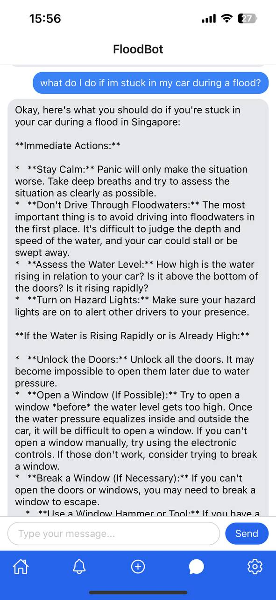

# FloodGuard

    
    
“Be Ready, Wherever the Rain Hits.”

FloodGuard is an all-in-one flood safety companion designed to provide Singaporean users with:
1. real-time and positional alerts, based on a user reporting system
2. flood warnings, from government authorities (NEA and PUB)
3. personalised assistance, through an AI chatbot, if users find themselves in a flood

Made for DSTA's Brainhack 2025 Code EXP hackathon, in response to the "Crisis Management and Reporting" prompt.

## Core Features

#### FloodMap

    
    
    

 

The main page of the app, featuring a map of Singapore, provides a cartographic display of the on-going flooding events(pins), informing users of which areas to avoid. Clicking on the pins also reveals a thumbnail image of the flooding event, and the alerts tab provides a summary of the events occuring.

#### Notifications and Warnings

    
    

 

Displays the most recent flood reports and warnings from PUB/NEA. Users can click on any of the reports/warnings to see more information or view the location of the report on the map 

#### Reporting

    

 

Allows the user to submit a report if they encounter a flood, with a description, location(to display on the FloodMap) and up to 5 images capturing the flood. We plan to leverage AI to verify these images to filter out false reports.

#### FloodBot

    
    

 

AI chatbot with additional context to provide assistance to Singaporeans that find themselves in a flood or want to learn more about flood preparedness and safety.

#### Settings

    

 

A settings page for the user to configure the app's notifications settings.

## Tech Stack

Technology|Purpose|Rationale
-|-|-
 | Cross-platform mobile app framework | Allows the app to function on both Android and iOS devices without having to write the app separately for each.
 | Development platform for React Native | Allows for rapid setup for development and prototyping.
 | CSS Frameworks | Provides utility classes for styling without writing any CSS code.
 | Backend as a Service | Hosts the databases and filestorage bucket for the app, allowing the app to adopt a serverless approach.
 | AI | Provides the chat backend for FloodBot.

## Miscellaneous

[Pitch Slides](Pitch-Slides.pdf)

[Pitch Video](https://youtu.be/hPfeRuxmKIo)

[Development](dev.md)