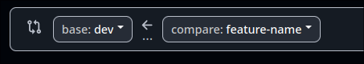

# FloodGuard

[](#) [](#) [](#) 

### Setup for Dev

1. Clone the repo
```
git clone -b dev https://github.com/alieron/floodguard.git
cd floodguard
```
2. Install dependencies
```
npm i
```
3. Development
```
npm run dev 
```
> runs the expo dev server

### Gitflow

#### Making a new feature

1. sync your **local** `dev` branch with the **remote** `dev` branch
```
git checkout dev
git pull
```

2. create a new **local** feature branch
```
git checkout -b <branch-name>
```

3. create the **remote** branch for this feature
```
git push -u origin <branch-name>
```
> `-u` sets the upstream remote branch for your local branch

4. stage and commit as usual

- use present tense verbs
- make frequent and incremental commits, but ensure that the app is in a working state before every commit

5. push your changes to the **remote** branch

- push frequently as well
```
git push
```
> don't need the `-u ...` since upstream is already set

#### Merging your feature into `dev`

1. make a pull request on github

- ensure the base branch is set to `dev`, don't pull request to `master`


2. detailing your pull request

- summaries your feature in the title
- if your pull request fixes any issues, use the [keywords](https://docs.github.com/en/issues/tracking-your-work-with-issues/using-issues/linking-a-pull-request-to-an-issue#linking-a-pull-request-to-an-issue-using-a-keyword) to link your pull request to this issue

3. merge

- if there are no merge conflicts and you're confident, merge
- if not, request for a review

4. delete your branch, both **local** and **remote**
```
git branch -D <branch-name>
git push -D origin <branch-name>
```

#### New feature merged into `dev`, that you want to use in your feature

1. pull `dev`
```
git checkout dev
git pull
```

2. locally merge `dev` into your branch
```
git checkout <branch-name>
git merge dev
```

3. resolve any merge conflicts locally

- use the vscode ui to choose which changes to keep

4. continue developing on your branch as ususal